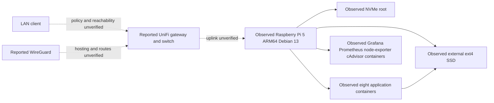

# Networking and architecture

Pi-agent observations and reported network roles are shown below. Dashed paths
need physical/access-policy confirmation. No real addresses are published.

The direct [live audit](../docs/live-audit-2026-09-30.md) observes twelve total
containers: eight applications and four monitoring components. Eleven use
compose_default; npm uses the default bridge. Published host ports bind all
IPv4/IPv6 interfaces: 80/81/443, 3000, 9100, 8081, 9090, 8096, 9000, 8080,
6881 TCP/UDP, 7878, 8989, 9696 and 8191. Firewall inspection was denied;
router forwards, VLAN/VPN policy and internet reachability remain UNKNOWN.
All-interface publishing alone does not prove internet exposure.

## Diagnose the concrete Radarr integration symptom

Separate these layers before editing settings. A Radarr client Test can create
a missing category and needs that approved scope; use bounded read-only probes
and current health evidence first.

| Layer | Read-only evidence | What a failure suggests |
| --- | --- | --- |
| Container/process | Selective ps, health and restart count | Process or runtime problem; running is not readiness |
| DNS | Resolve configured client from Radarr; inspect exit only | Wrong hostname/network or unavailable resolver |
| TCP/HTTP | Credential-free bounded HTTP status from Radarr | Connection failure or app listener; 401/403 establishes a response |
| Authentication | Accepted API login and SID using matching Origin/Referer, values kept private | HTTP 200 alone is not successful login; avoid repeated guesses |
| Path translation | Actual completed path and mapped host directory | Runtime shares host downloads: /data/downloads in qBittorrent, /downloads in Radarr; mapping exists, successful import unverified |
| Permissions/storage | Numeric owners, ACLs, mount and capacity | A demonstrated reader/writer mismatch or missing storage |

[Prepared follow-ups](../docs/prepared-changes.md) withdraw the original candidate
bind correction. Actual Radarr UID 1000 resolves qbittorrent and receives HTTP
200 from qbittorrent:8080; unauthenticated API returns 403. The enabled client's
configured private endpoint times out from Radarr (curl 28, HTTP 000), while the
service-name path responds. Initial stored and startup credentials did not
establish an API session. Current login availability is UNKNOWN after a later
observed restart/profile change. A reset is prepared, not applied. That identifies a
failing transport path and separate authentication blocker; specific upstream
routing/firewall cause is not established.

The initial archive/candidate settings are historical. Later live configuration
has a matching remote-path mapping. Keep DNS, transport, authentication, queue
retrieval and file import as separate observations. Active qBittorrent paths and
queue/import behavior require authentication before an approved correction.

## Access policy worksheet

Keep private endpoint details outside Git. For each service record intended
LAN, trusted VPN and prohibited-network access, authentication, protocol and
read-only test. Use a normal authorized LAN client before diagnosing remote
access. Router/switch/WireGuard administration needs separately authorized
access; none was established in this session. No firewall/VPN changes are
prepared from assumptions.
