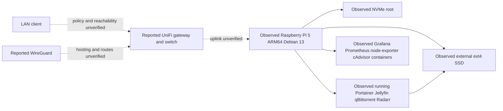

# Networking and architecture

Pi-agent observations and reported network roles are shown below. Dashed paths
need physical/access-policy confirmation. No real addresses are published.

The candidate source publishes 9000, 8096, 8080, 7878 and 6881 TCP/UDP without
host-IP constraints. It is a historical candidate, not the current runtime
source. Actual listener scope, full Docker networks, gateway forwards, IPv6,
VLANs and VPN access remain unknown. A newer Pi-agent check established one
Radarr-to-qBittorrent DNS/HTTP path; it does not establish all network access.
See [runtime evidence](../docs/pi-runtime-follow-up.md).

## Diagnose the concrete Radarr integration symptom

Recent bounded Radarr log tails report queue/history retrieval warnings.
Start with the configured client Test in Radarr, privately. Then distinguish:

| Layer | Read-only evidence | What a failure suggests |
| --- | --- | --- |
| Container/process | Selective ps, health and restart count | Process or runtime problem; running is not readiness |
| DNS | Resolve configured client from Radarr; inspect exit only | Wrong hostname/network or unavailable resolver |
| TCP/HTTP | Credential-free bounded HTTP status from Radarr | Connection failure or app listener; 401/403 establishes a response |
| Authentication | Existing application client Test | Incorrect credentials/access policy; do not paste them into commands |
| Path translation | Actual completed path and mapped host directory | Runtime shares host downloads: /data/downloads in qBittorrent, /downloads in Radarr; mapping exists, successful import unverified |
| Permissions/storage | Numeric owners, ACLs, mount and capacity | A demonstrated reader/writer mismatch or missing storage |

[Prepared follow-ups](../docs/prepared-changes.md) withdraw the original candidate
bind correction. Actual Radarr UID 1000 resolves qbittorrent and receives HTTP
200 from qbittorrent:8080. Its enabled client uses a different configured host
and reports a health error. A different hostname is not proof of a wrong setting;
the Pi agent must inspect the exact configured path and Test error privately.

The initial archive/candidate settings are historical. Later live configuration
has a matching remote-path mapping. Keep DNS, transport, authentication, queue
retrieval and file import as separate observations; no root cause is claimed.

## Access policy worksheet

Keep private endpoint details outside Git. For each service record intended
LAN, trusted VPN and prohibited-network access, authentication, protocol and
read-only test. Use a normal authorized LAN client before diagnosing remote
access. Router/switch/WireGuard administration needs separately authorized
access; none was established in this session. No firewall/VPN changes are
prepared from assumptions.
