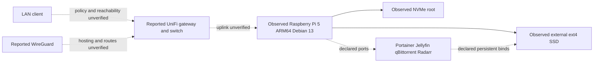

# Networking and architecture

Observed Pi/storage and Compose declarations are shown below. Dashed paths are
owner-reported or require runtime confirmation. No real addresses are published.

The candidate source publishes 9000, 8096, 8080, 7878 and 6881 TCP/UDP without
host-IP constraints. Runtime listeners, Docker networks, DNS, gateway forwards,
IPv6 policy, VLANs and VPN access are unknown. Empty socket/route tables and DNS
errors inside this restricted session cannot establish a host network failure.

## Diagnose the concrete Radarr integration symptom

Recent bounded Radarr log tails report queue/history retrieval warnings.
Start with the configured client Test in Radarr, privately. Then distinguish:

| Layer | Read-only evidence | What a failure suggests |
| --- | --- | --- |
| Container/process | Selective ps, health and restart count | Process or runtime problem; running is not readiness |
| DNS | Resolve configured client from Radarr; inspect exit only | Wrong hostname/network or unavailable resolver |
| TCP/HTTP | Credential-free bounded HTTP status from Radarr | Connection failure or app listener; 401/403 establishes a response |
| Authentication | Existing application client Test | Incorrect credentials/access policy; do not paste them into commands |
| Path translation | Current completed path and mapped host directory | Both /downloads names currently point to different directories |
| Permissions/storage | Numeric owners, ACLs, mount and capacity | A demonstrated reader/writer mismatch or missing storage |

[Prepared commands and conditional correction](../docs/prepared-changes.md)
preserve the original source and rollback. Do not infer that a mount mismatch
causes the queue/history connectivity warning: these can be separate problems.

The backed-up Radarr client host is not the Compose service DNS name and its
remote prefix does not cover qBittorrent's current default /downloads.
Those settings may be stale; inspect live configuration before changing them.

## Access policy worksheet

Keep private endpoint details outside Git. For each service record intended
LAN, trusted VPN and prohibited-network access, authentication, protocol and
read-only test. Use a normal authorized LAN client before diagnosing remote
access. Router/switch/WireGuard administration needs separately authorized
access; none was established in this session. No firewall/VPN changes are
prepared from assumptions.
